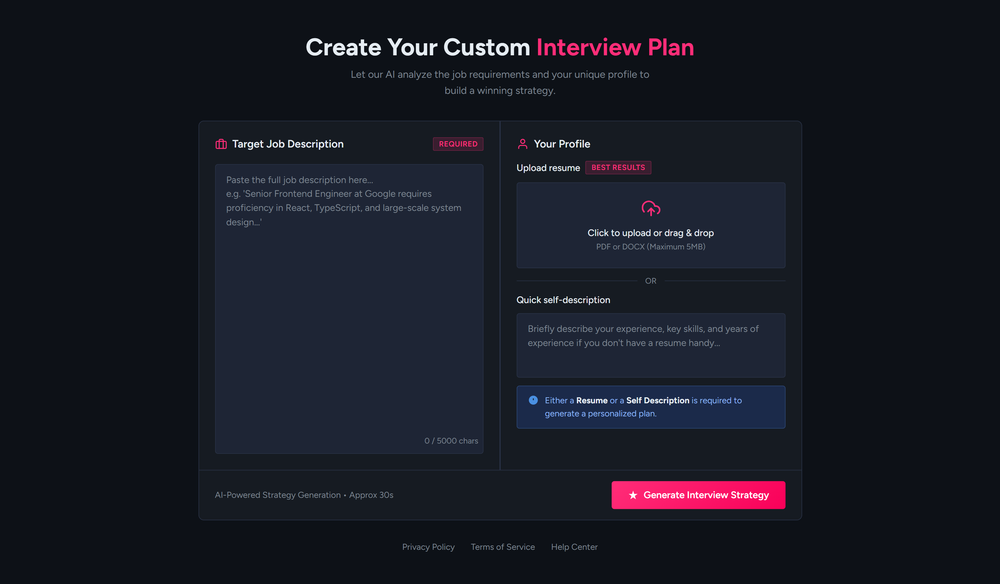
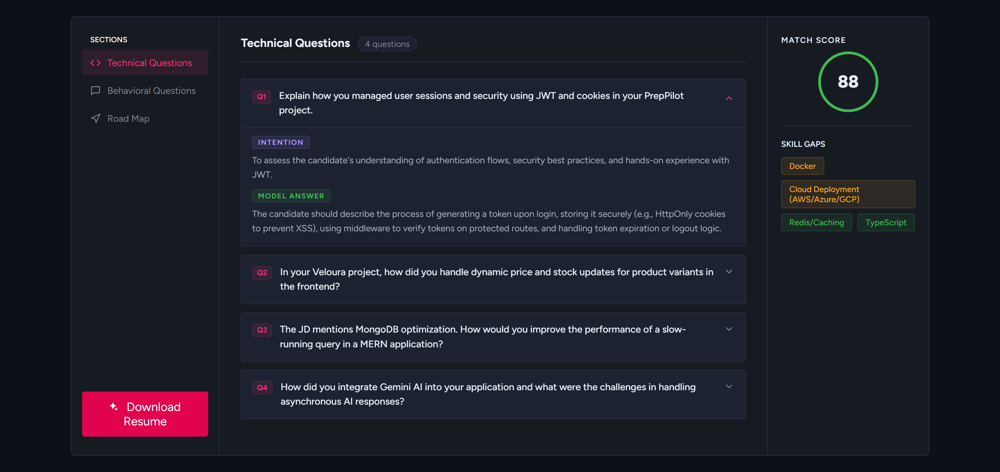
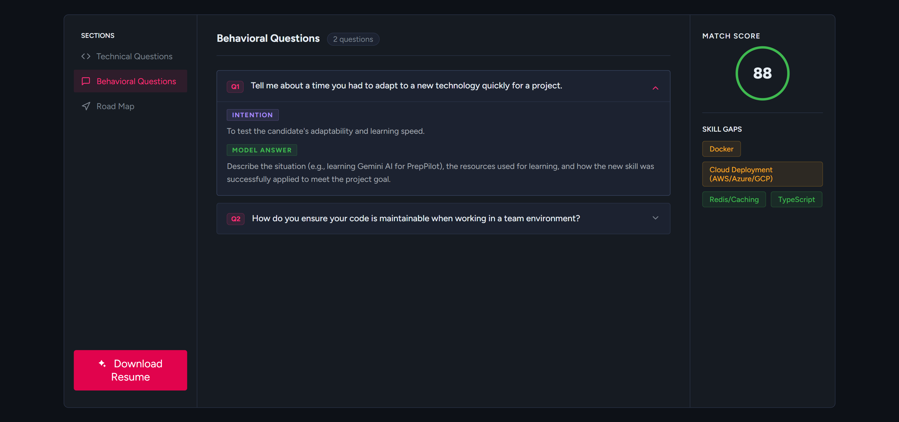
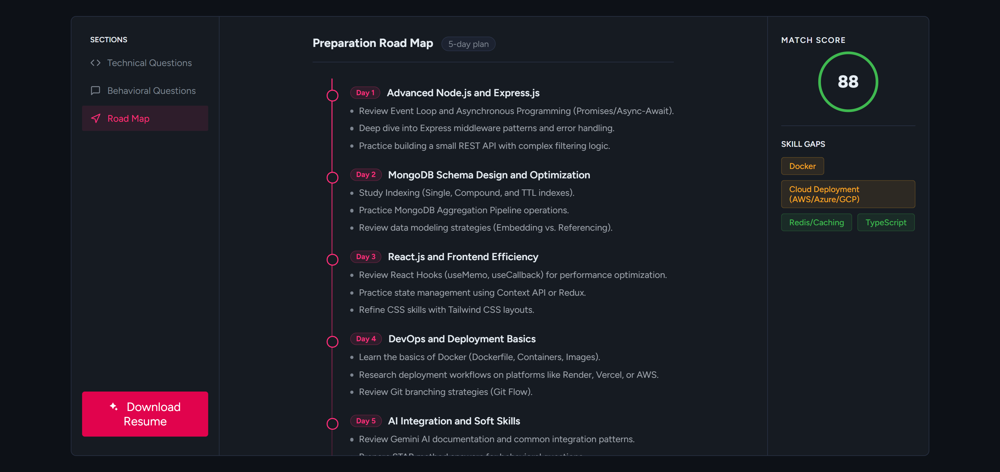

# PrepPilot

PrepPilot is an AI-powered interview preparation platform built using the MERN stack. It helps users analyze their resumes against target job descriptions, identify skill gaps, generate interview questions, and create personalized preparation plans using Gemini AI.

## Features

### Authentication

- User registration and login
- JWT-based authentication
- Password hashing using bcrypt
- Protected API routes
- Secure cookie-based authentication

### AI-Powered Resume Analysis

- Upload a resume
- Provide a target job description
- Analyze compatibility between the resume and the target role
- Identify missing skills and improvement areas

### Interview Preparation

- Generate technical interview questions
- Generate behavioral interview questions
- View the intention behind each question
- Access sample answers for preparation

### Personalized Roadmap

- AI-generated preparation strategy
- Structured learning recommendations
- Personalized interview preparation plan

### Skill Gap Analysis

- Overall profile score
- Missing skills identification
- Actionable improvement suggestions

### ATS-Friendly Resume Support

- Resume generation workflow tailored to target job requirements

### Report Management

- Access previously generated reports
- Review past interview preparation strategies

---

## Tech Stack

### Frontend

- React.js
- Vite
- React Router
- SCSS

### Backend

- Node.js
- Express.js

### Database

- MongoDB

### AI Integration

- Gemini API

### Authentication & Security

- JWT
- bcrypt
- HTTP Cookies

---

## Screenshots

### Home Page



### Technical Interview Questions



### Behavioral Interview Questions



### Personalized Roadmap



---

## Project Architecture

The backend follows the MVC (Model-View-Controller) architecture pattern.

- Models for database operations
- Controllers for business logic
- Routes for API endpoints
- Middleware for authentication and request handling

---

## Installation

### 1. Clone the Repository

```bash
git clone <repository-url>
cd PrepPilot
```

### 2. Install Frontend Dependencies

```bash
cd Frontend
npm install
```

### 3. Install Backend Dependencies

```bash
cd Backend
npm install
```

---

## Environment Variables

Create a `.env` file in the `Backend` directory and add the following variables:

```env
MONGODB_URI=your_mongodb_connection_string
JWT_SECRET=your_jwt_secret
GEMINI_API_KEY=your_gemini_api_key
```

---

## Running the Application

### Start Backend

```bash
cd Backend
npm run dev
```

### Start Frontend

```bash
cd Frontend
npm run dev
```

The frontend and backend should now be running locally.

---

## Future Improvements

- Logout functionality
- Fully responsive design
- Migration from SCSS to Tailwind CSS
- Enhanced report analytics
- Additional AI-powered insights

---

## Learning Outcomes

This project helped me gain practical experience in:

- Backend development
- REST API design
- Authentication and authorization
- MongoDB integration
- AI API integration
- MVC architecture
- Full-stack application development

---

## Author

**Anurag Vaidya**

If you have feedback, suggestions, or would like to discuss the project, feel free to open an issue or connect with me on LinkedIn.
